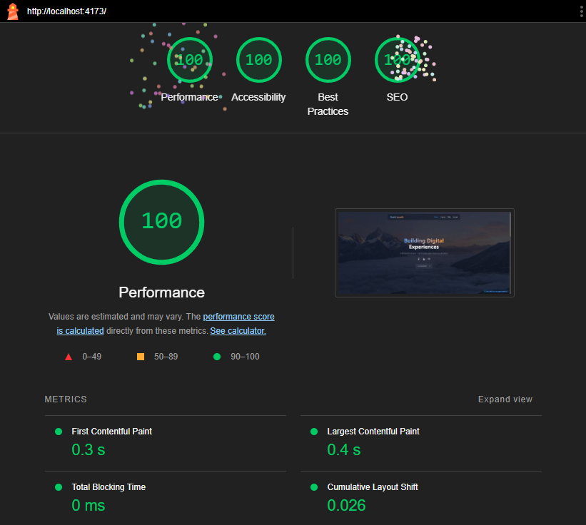

<h1>David's Portfolio Template</h1>

> A lightning-fast, SEO-optimized portfolio website with automated AWS deployment

<p align="center"></p>

-----

<p align="center"><a target="_blank" href="https://djoz.us/"></a></p>


<!-- TOC -->
* [Overview](#overview)
* [Features](#features)
  * [⚡️ **Performance**](#-performance)
  * [🎨 **Design & Content**](#-design--content)
  * [🛠 **Developer Experience**](#-developer-experience)
  * [🚀 **Deployment**](#-deployment)
* [Getting Started](#getting-started)
  * [Prerequisites](#prerequisites)
  * [Building Your Portfolio Website](#building-your-portfolio-website)
    * [Initial Setup](#initial-setup)
    * [Content Customization](#content-customization)
    * [Development Workflow](#development-workflow)
    * [Deployment Options](#deployment-options)
    * [Version Control](#version-control)
    * [Maintenance](#maintenance)
  * [(Optional) Deploy to AWS](#optional-deploy-to-aws)
    * [Overview](#overview-1)
    * [Infrastructure Overview](#infrastructure-overview)
    * [Prerequisites](#prerequisites-1)
    * [Deployment Steps](#deployment-steps)
      * [1. DNS Configuration](#1-dns-configuration)
      * [2. GitHub Actions Setup](#2-github-actions-setup)
      * [3. Repository Configuration](#3-repository-configuration)
      * [4. Infrastructure Configuration](#4-infrastructure-configuration)
      * [5. Deployment](#5-deployment)
    * [Alternative DNS Setup](#alternative-dns-setup)
    * [Deploying Locally](#deploying-locally)
    * [Manually Rebuilding the Site & Forcing Cache Invalidation](#manually-rebuilding-the-site--forcing-cache-invalidation)
  * [(Optional) Destroying the AWS Infrastructure](#optional-destroying-the-aws-infrastructure)
* [Good to Know](#good-to-know)
  * [React SPA](#react-spa)
  * [Terraform](#terraform)
  * [Lambda Functions](#lambda-functions)
    * [Contact Form Submission](#contact-form-submission)
    * [API Gateway Authorizer](#api-gateway-authorizer)
* [Key Technologies](#key-technologies)
* [License](#license)
* [Contributing](#contributing)
<!-- TOC -->

# Overview

This portfolio template provides a production-ready website solution combining modern frontend technologies with
automated cloud deployment. Built with React and TypeScript, it delivers exceptional performance while maintaining full
SEO optimization and accessibility standards.

# Features

## ⚡️ **Performance**

- Perfect 100/100 [Lighthouse](https://developer.chrome.com/docs/lighthouse/overview) score for performance,
  accessibility, best practices, and SEO
- CDN-powered global content delivery for fast load times
- Optimal SEO configuration
- Fully statically rendered

## 🎨 **Design & Content**

- Modern glassmorphic design
- Responsive single-page application
- Easy content customization through a single file ([content.tsx](./client/src/content.tsx))
- Eye-catching animations, disabled if user prefers reduced motion

## 🛠 **Developer Experience**

- Built with TypeScript & React
- Automated, low-cost, and secure AWS deployment pipeline (less than $5 per month)
- Integrated contact form system

## 🚀 **Deployment**

- Terraform configuration for easy setup
- GitHub Actions for CI/CD when code changes
- CloudFormation for bootstrapping Terraform state storage

# Getting Started

If you'd like to use this template to create your own portfolio website,
click ["use this template"](https://github.com/new?template_name=djoz-portfolio&template_owner=Unit2795) at the top of
the repository. You can then clone your new repository and follow the instructions below to build and deploy your site.

## Prerequisites

- [Node.js](https://nodejs.org/en/) >= 22
- [pnpm](https://pnpm.io/installation) >= 9.0
- Basic familiarity with React, TypeScript, and GitHub
- A code editor like [VS Code](https://code.visualstudio.com/) or [WebStorm](https://www.jetbrains.com/webstorm/)
- (Optional) AWS account for cloud deployment
- (Optional) Domain name for live deployment

## Building Your Portfolio Website

In order to build the website's static files, you'll need to follow these steps:

### Initial Setup

1. **Install Dependencies**
   ```bash
   # Navigate to the client directory
   cd client
   
   # Install project dependencies
   pnpm install
   ```

### Content Customization

2. **Update Site Content**
   The site's content is managed through a single file ([content.tsx](./client/src/content.tsx)) for simplicity:
   ```bash
   # Edit the main content file
   vim src/content.tsx  # or use your preferred editor
   ```
   > **Why Static Content?**
   > This portfolio uses static content generation for optimal performance and SEO. While this means content updates
   require a rebuild, it eliminates the overhead and complexity of a CMS. For simple portfolio sites, this tradeoff
   improves page load times and reduces hosting costs.
   >
   > If you need dynamic content, you can modify `content.tsx` to fetch data from a headless CMS or API.

3. **Replace Images**
   ```bash
   # Project thumbnails
   public/project/         # Add your project images here
   
   # Hero image
   public/hero.webp       # Replace with your hero image
   
   # Favicon
   public/favicon/        # Generate from https://favicon.io and place here
   ```

   Image Guidelines:
    - Use WebP format with the lowest quality you can manage for optimal performance
    - Project thumbnails: 500x180 recommended
    - Hero image: Minimum 1920x1080px
    - Favicon: Generate a complete set from [favicon.io](https://favicon.io/favicon-converter/)

### Development Workflow

4. **Start Development Server**
   ```bash
   # Start local development
   pnpm dev
   
   # Access your site at
   http://localhost:5173
   ```

5. **Build for Production**
   ```bash
   # Create optimized build
   pnpm build
   
   # Preview production build
   pnpm preview
   ```
   > The production build will be created in the `/dist` directory, ready for deployment.

### Deployment Options

6. **Choose Your Deployment**

   **Option A: Automated AWS Deployment**
    - Follow the AWS deployment guide in the next section
    - Includes CDN, SSL certificate, DNS records, contact form submission API endpoint, and email notifications

   **Option B: Static Host**
    - Deploy the `/dist` directory to:
        - Netlify
        - Vercel
        - GitHub Pages
    - Configure contact form:
      ```typescript
      // Edit src/components/ContactForm/ContactForm.tsx
      // Modify the onSubmit handler to accomodate to your form service
      ```
    - Some available form services:
        - [Formspree](https://formspree.io/)
        - [Web3Forms](https://web3forms.com/)

### Version Control

7. **Commit Your Changes**
   ```bash
   git add .
   git commit -m "customize portfolio content"
   git push origin main
   ```

### Maintenance

To merge updates from the template repository:

   ```bash
   # Add the template as a remote
   git remote add template https://github.com/Unit2795/djoz-portfolio.git
   
   # Fetch updates
   git fetch template
   
   # Merge updates (resolve conflicts if needed)
   git merge template/main
   ```

> You can also just clear your repository out, copy the files from the template repository to your own repository, and
> selectively add back your changes.

## (Optional) Deploy to AWS

> 💡 Optional Deployment: You can alternatively host on platforms like Netlify or Vercel
>
> ⚠️ Warning: AWS services used in this deployment will incur costs (less than $5 per month). Make sure to monitor your
> usage to avoid unexpected charges.

### Overview

This guide walks you through deploying your portfolio using AWS infrastructure. The deployment is automated using GitHub
Actions and Terraform, providing you with a production-grade setup including CDN delivery and a serverless backend.

### Infrastructure Overview

The deployment automatically provisions:

- **CloudFront** - Global CDN for fast content delivery
- **S3** - Secure static file hosting & Terraform state storage
- **DynamoDB** - Terraform state locking
- **Lambda** - Serverless backend for contact form
- **API Gateway** - Endpoint for contact form submissions
- **IAM** - Identity and Access Management for secure AWS access
- **CloudFormation** - Bootstraps the Terraform state storage
- **SES** - Email handling for form submissions
- **ACM** - SSL/TLS certificate management
- **Route 53** - DNS management (optional)

### Prerequisites

- AWS Account with administrative access
- GitHub account
- Registered domain name
- Basic AWS familiarity
- 30-45 minutes for setup

### Deployment Steps

#### 1. DNS Configuration

Create a Route 53 hosted zone for your domain using the AWS CLI or in the AWS Console

```bash
# Create Route 53 hosted zone (if using AWS DNS)
aws route53 create-hosted-zone \
  --name yourdomain.com \
  --caller-reference $(date +%s)

# Note the nameservers for your domain registrar
aws route53 get-hosted-zone --id /hostedzone/ZONEID
```

Using another DNS provider? See [Alternative DNS Setup](#alternative-dns-setup).

#### 2. GitHub Actions Setup

1. Create an IAM Identity Provider using AWS CLI or in the AWS console for GitHub Actions to use.
    1. **Provider URL**: `https://token.actions.githubusercontent.com`
    2. **Audience**: `sts.amazonaws.com`

2. Create an IAM Role
    1. Make note of the name you give this role, you will need it later.
    2. Select **Web Identity** as the trusted entity type.
    3. Set **Identity Provider** to the one you just created `token.actions.githubusercontent.com`
    4. Set **Audience** to `sts.amazonaws.com`
    5. Set the GitHub organization (your username if you don’t have one). You may also optionally specify the repo and
       the branch.
        1. Example of multiple repos/branches:
       ```json
       "token.actions.githubusercontent.com:sub": [
          "repo:<organization-or-username>/<repo-1>:ref:refs/heads/<branch-1>",
          "repo:<organization-or-username>/<repo-1>:ref:refs/heads/<branch-2>",
          "repo:<organization-or-username>/<repo-2>:ref:refs/heads/<branch-1>",
          "repo:<organization-or-username>/<repo-3>:ref:refs/heads/*"
       ]
       ```
    6. Copy your AWS account ID. It can be found in the top right of the AWS web Console when you click your name. The
       dropdown menu will show your “Account ID”

#### 3. Repository Configuration

1. Add GitHub Secrets:
   ```bash
   AWS_ACCOUNT_ID      # Your AWS Account ID
   AWS_IAM_ROLE_NAME   # Role name from step 2
   ```

2. Add GitHub Variables:
   ```bash
   AWS_DEFAULT_REGION  # e.g., us-east-1
   ```

#### 4. Infrastructure Configuration

1. Update Terraform variables:
   ```hcl
   # terraform/terraform.tfvars
    domain_name        = "example.com"
    aws_region         = "us-east-1"
    bucket_name        = "djoz-portfolio"
    admin_email        = "johndoe@example.com"
   ```

2. (Optional) Configure state backend:
   ```hcl
   # terraform/state.config
    bucket = "tf-state-djoz-portfolio"
    key = "terraform.tfstate"
    dynamodb_table = "tf-state-djoz-portfolio-lock"
    region = "us-east-1"
   ```
   
3. (Optional) Select SES Email sending identity:
    - By default, the template uses `Email-Based` sending identity for SES. If you have a verified domain, you can switch to the `Domain-Based` sending identity by updating the [ses.tf](./terraform/ses.tf) file.

#### 5. Deployment

1. Push changes to trigger deployment:
   ```bash
   git add .
   git commit -m "configure aws deployment and content"
   git push origin main
   ```

2. Monitor the deployment:
    - Check GitHub Actions tab
    - **If you are using the Email-Based sending identity for SES**: You'll receive an email from Amazon SES to verify your `admin_email` address provided in
      the [terraform.tfvars](./terraform/terraform.tfvars) file if you haven't already added this email to SES before. You must click the verification link before you can
      send emails from/to this address. This admin email is where you will receive contact form submissions.
    - Wait for CloudFront distribution (~15-30 min)

### Alternative DNS Setup

If not using Route 53:

1. Remove Route 53 configurations from [acm.tf](./terraform/acm.tf) and [cloudfront.tf](./terraform/cloudfront.tf)
   files.
2. Configure DNS manually:
    - Get ACM validation records from AWS Console
    - Add CNAME records to your DNS provider
    - Add CloudFront distribution CNAME

### Deploying Locally

If you prefer not to use GitHub Actions, you can deploy the site locally using the AWS CLI and Terraform CLI. You'll
need to install and configure the AWS CLI and Terraform CLI.

### Manually Rebuilding the Site & Forcing Cache Invalidation

If you need to manually rebuild the site and force cache invalidation on CloudFront, you can set the
`FORCE_INVALIDATION` environment variable to `1` in your GitHub repository. Then manually trigger the "Build and Deploy"
workflow. This will trigger a cache invalidation on CloudFront after the deployment.

## (Optional) Destroying the AWS Infrastructure

If you want to take down the website, you can run the `terraform-destroy` workflow in the GitHub Actions tab of your
repository. This will remove all the AWS resources that were created by Terraform. You may also manually run
`terraform destroy` from your local machine if you have the AWS and Terraform CLIs installed and configured.

# Good to Know

## React SPA

1. The majority of the site's content is stored in the [content.tsx](./client/src/content.tsx) file. Some content can be
   disabled entirely.
2. All of the animations are disabled if the user prefers reduced motion.
3. The site is fully responsive and optimized for mobile devices.
4. The most complex part of the React code is the [Navbar](./client/src/components/Navbar/Navbar.tsx) component, which
   handles the dynamically resizing navbar and the smooth scrolling to sections.

## Terraform

1. All user-provided variables are stored in the [terraform.tfvars](./terraform/terraform.tfvars)
   and [state.config](./terraform/state.config) files.
2. The `/bootstrap` directory contains the CloudFormation code and shell script that creates the S3 bucket and DynamoDB
   table for Terraform state storage.
3. The DNS records for the `www.` subdomain are created automatically in addition to the root domain you provide.
4. The `admin_email` variable in the [terraform.tfvars](./terraform/terraform.tfvars) file is used for receiving contact
   form submissions. If this has not already been verified in SES, an email with a verification link will be sent.
5. If you create multiple instances of this portfolio, you will need to update the variable files to ensure the
   important variables are unique or the deploy will fail.
6. The `terraform-destroy` workflow in the GitHub Actions tab will remove all the AWS resources that were created by
   Terraform.
7. The `terraform-apply` workflow in the GitHub Actions tab will apply the Terraform configuration to create the AWS
   resources, build the site, upload it, and invalidate the CloudFront cache.

## Lambda Functions

### Contact Form Submission

1. The [index.js](./lambda/index.js) file contains the Lambda function code for the contact form submission.
2. This function is triggered by an API Gateway POST request.
3. The function sends an email to the `admin_email` address provided in
   the [terraform.tfvars](./terraform/terraform.tfvars) file.

### API Gateway Authorizer

1. The [auth.js](./lambda/auth.js) file contains the Lambda function code for the API Gateway authorizer.
2. This authorizer prevents too many requests from being made to the contact form submission endpoint.
3. The default rate limit is 10 successful requests per month.
4. The lambda function is triggered by an API Gateway request.
5. The information about the number of requests that have been made is stored in a DynamoDB table.

# Key Technologies

- [React](https://react.dev/)
    - Library for building the single-page application
- [TypeScript](https://www.typescriptlang.org/)
    - Type safety for the React site
- [PNPM](https://pnpm.io/)
    - Efficient package manager
- [ESLint](https://eslint.org/)
    - Linter for JavaScript and TypeScript
- [Spacey](https://github.com/Unit2795/spacey)
    - ESLint shared config styleguide for TypeScript React projects
- [Tailwind CSS](https://tailwindcss.com/)
    - Utility-first CSS styling for the React site
- [Vite](https://vite.dev/)
    - Build tool for the React site
- [Terraform](https://www.terraform.io/)
    - Deploys the site to AWS CloudFront and sets up a back-end for receiving contact form submissions
- [GitHub Actions](https://github.com/features/actions)
    - Automates the deployment of the site to AWS using Terraform
- [CloudFormation](https://aws.amazon.com/cloudformation/)
    - Bootstraps the Terraform state backend in AWS

# License

This project is licensed under the MIT License. You are free to use, modify, and distribute this code as you see fit.
See the [LICENSE](./LICENSE) file for more information.

# Contributing

If you have any suggestions, improvements, or issues, please open an issue or a pull request. I'd love to hear your
feedback!

--------

<p align="center"></p>