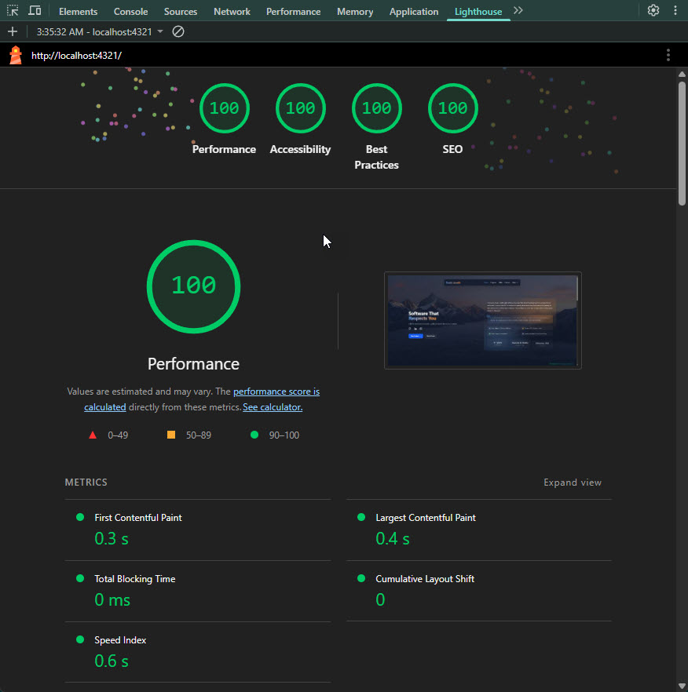

<h1>David's Portfolio Template</h1>

> A lightning-fast, SEO-optimized portfolio website with automated AWS deployment

---

- [Links](#links)
- [Overview](#overview)
  - [⚡️ **Performance**](#️-performance)
  - [🎨 **Design \& Accessibility**](#-design--accessibility)
  - [🚀 **API \& Deployment**](#-api--deployment)
- [Key Technologies](#key-technologies)
- [License](#license)
- [Contributing](#contributing)

# Links

[About](./docs/about.md) | [FAQs](./docs/faqs.md) | [Setup Guide](./docs/setup.md) | [Deployment Guide](./docs/deployment.md) | [Live Demo](https://djoz.us/) | [Use This Template](https://github.com/Unit2795/djoz-portfolio/generate)

# Overview

- Thank you for checking out my portfolio template! It is built with using [Astro](https://astro.build/) with vanilla HTML, JS, and [Tailwind CSS](https://tailwindcss.com/).
- The site is deployed using [Terraform](https://www.terraform.io/) and [GitHub Actions](https://docs.github.com/en/actions) and [AWS](https://aws.amazon.com/).
- Click "[use this template](https://github.com/Unit2795/djoz-portfolio/generate)" and follow the instructions in the [Setup Guide](./docs/setup.md) and [Deployment Guide](./docs/deployment.md) if you'd like to set up a copy of this website for yourself!
- Want to learn more about the reasoning behind the implementation of this portfolio, other helpful context, or FAQs? See the [About page](./docs/about.md)
- Need help or have a suggestion? Please create a GitHub issue.
- This is an ongoing project being actively updates

## ⚡️ **Performance**

- Fully statically rendered at build time with CMS content backed into HTML (> 30KB compressed)
- CDN-powered global delivery
- Completely functional without Javascript
- CSS/JS is built into the index.html file to reduce network requests
- Only 15 KB of JS ships with site
- 100/100 [Lighthouse](https://developer.chrome.com/docs/lighthouse/overview) score

## 🎨 **Design & Accessibility**

- Modern glassmorphic design
- Responsive down to 320 pixel width
- Easy content customization through a single file ([content/index.ts](./client/src/content/index.ts))
- Fully accessible. Reads well with screen readers, can zoom to 200%, high contrast, large clickable regions, semantic HTML and aria attributes. Working towards WCAG 2.2 AA conformance
- Eye-catching animations, disabled if user prefers reduced motion

## 🚀 **API & Deployment**

- Automated, low-cost, and secure AWS deployment (less than $2 per month) using Terraform for easy setup
- GitHub Actions for CI/CD when code changes
- CloudFormation script for bootstrapping Terraform state storage in AWS S3 & DynamoDB
- Contact form and analytics APIs with abuse protection

# Key Technologies

- [Astro](https://astro.build/)
  - Library for building the static generated site
- [Tailwind CSS](https://tailwindcss.com/)
  - Utility-first CSS styling
- [TypeScript](https://www.typescriptlang.org/)
  - Type safety for the site
- [PNPM](https://pnpm.io/)
  - Efficient package manager
- [ESLint](https://eslint.org/)
  - Code linter
- [Prettier](https://prettier.io/)
  - Code formatting
- [Vite](https://vite.dev/)
  - Build tool used by Astro
- [Node.js](https://nodejs.org/en/)
  - JavaScript runtime for Lambda functions
- [AWS](https://aws.amazon.com/)
  - Cloud provider for the site and APIs
- [Terraform](https://www.terraform.io/)
  - Infrastructure as Code library that deploys the site and manages resources
- [GitHub Actions](https://github.com/features/actions)
  - Automates the deployment of the site to AWS using Terraform and Linux
- [CloudFormation](https://aws.amazon.com/cloudformation/)
  - Bootstraps the Terraform state backend in AWS

# License

This project is licensed under the MIT License. You are free to use, modify, and distribute this code as you see fit. See the [LICENSE](./LICENSE) file for more information.

# Contributing

If you have any suggestions, improvements, or issues, please create a GitHub issue or a pull request. I'd love to hear your feedback!

---

